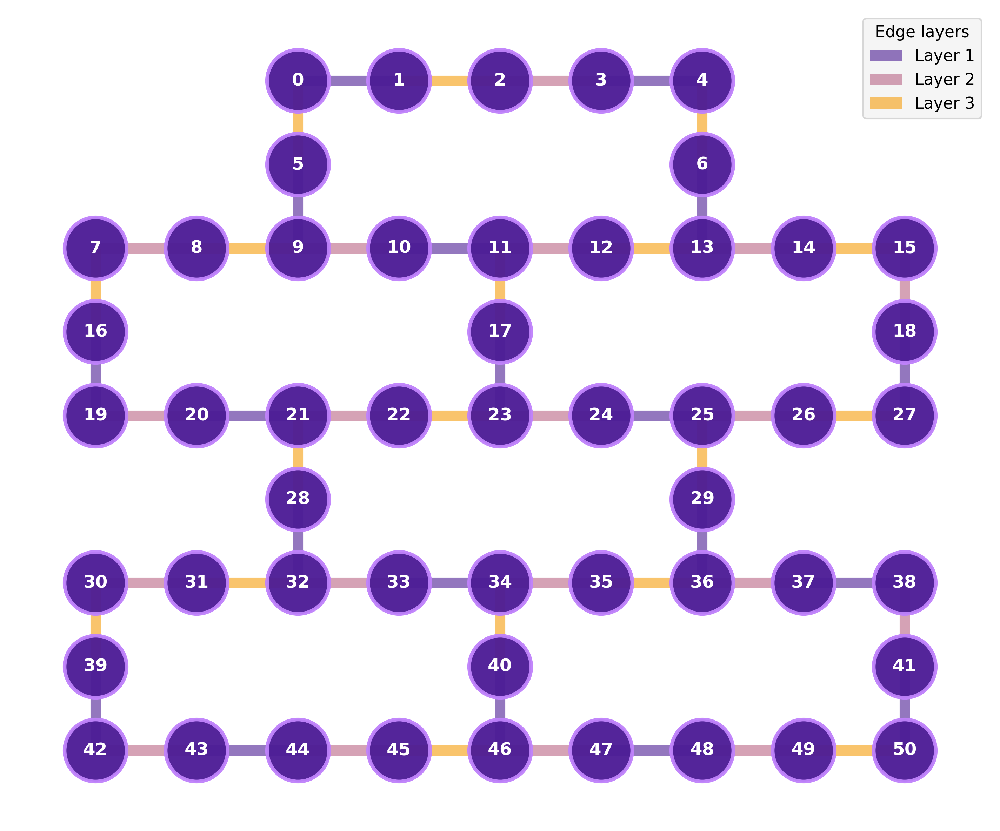
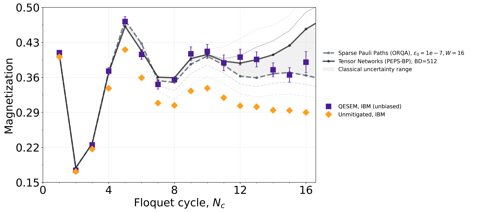
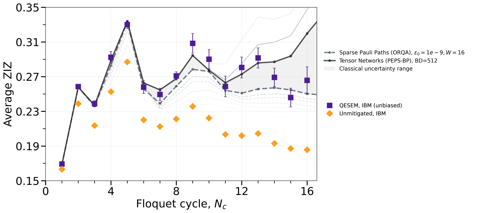
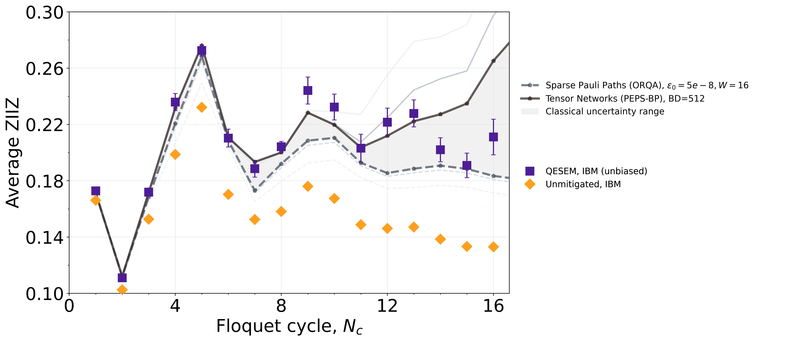

# Floquet Mixed-Field Ising Dynamics 


## Circuit Instances

`floquet_mixed_field_ising_mag_51qx16c`:

This instance implements Floquet dynamics corresponding to the mixed-field Ising model on the heavy-hex lattice with $N=51$ qubits and $N_c=16$ Floquet cycles (see details below). The measured observable is
the average magnetization, defined as
$$M = \frac{1}{N}\sum_{i} Z_i,$$
where the sum runs over all the qubits of the heavy-hex lattice.


`floquet_mixed_field_ising_zzd2_51qx16c`:

This instance implements Floquet dynamics corresponding to the mixed-field Ising model on the heavy-hex lattice with $N=51$ qubits and $N_c=16$ Floquet cycles (see details below). The measured observable is
the average two-point correlator at graph distance $d=2$, defined as

```math
ZZ_{d=2} = \frac{1}{N_{d=2}} \; \sum_{(i,j)\,:\,d(i,j)=2} Z_i Z_j
```

where $(i, j)$ ranges over all pairs of qubits at graph distance $d=2$ within the heavy-hex lattice (see pair list below), and $N_{d=2}$ is the total number of those pairs. 

`floquet_mixed_field_ising_zzd3_51qx16c`:

This instance implements Floquet dynamics corresponding to the mixed-field Ising model on the heavy-hex lattice with $N=51$ qubits and $N_c=16$ Floquet cycles (see details below). The measured observable is
the average two-point correlator at graph distance $d=3$, defined as

```math
ZZ_{d=3} = \frac{1}{N_{d=3}} \; \sum_{(i,j)\,:\,d(i,j)=3} Z_i Z_j
```

where $(i, j)$ ranges over all pairs of qubits at graph distance $d=3$ within the heavy-hex lattice (see pair list below), and $N_{d=3}$ is the total number of those pairs. 

* Each instance here is defined by the number of qubits, $N$, the number of Floquet cycles, $N_c$, as well as the observable measured at the end of the circuit. Thus, the name of the instance follows the pattern `floquet_mixed_field_ising_{measured observable}_{N}qx{N_c}c`.


## Model Description
The experiment explores non-equilibrium Floquet dynamics of the 2D mixed-field Ising model on a heavy-hex lattice of $N$ qubits.
In those circuits, the qubits are initialized in
$$|\psi_0\rangle = |0\rangle^{\otimes N}$$
and evolved over $N_c$ Floquet cycles to

$$|\psi(N_c)\rangle = U_F^{N_c} |\psi_0\rangle.$$

Each Floquet cycle $U_F = U_3 \cdot U_2 \cdot U_1$ consists of three layers, where:

```math
U_m = \prod_{(j,k)\in\mathcal{E}_m} RZZ(\theta_{zz}) 
      \prod_{i} RZ\left(\tfrac{\theta_z}{3}\right) 
      \prod_{i} RX\left(\tfrac{\theta_x}{3}\right)
```

Here $\mathcal{E}_1, \mathcal{E}_2, \mathcal{E}_3$ is a partition of all edges 
of the $N$-qubit patch into three disjoint subsets.

## Additional Details

**Additional details for the circuit instances corresponding to the $N=51$-qubit lattice**:

* Lattice

    The 51-qubit patch follows the IBM heavy-hex connectivity, with qubits indexed 0-50. The lattice is shown below; different edge colors correspond to the three edge layers $\mathcal{E}_1, \mathcal{E}_2, \mathcal{E}_3$ (see the table below).

 

* Edge Layers 

    | Layer           | Edges                                                                                                                                                                   |
    |-----------------|-------------------------------------------------------------------------------------------------------------------------------------------------------------------------|
    | $\mathcal{E}_1$ | [(0, 1),(3, 4),(5, 9),(10, 11),(6, 13),(16, 19),(20, 21),(17, 23),(24, 25),(18, 27),(28, 32),(33, 34),(29, 36),(37, 38),(39, 42),(43, 44),(40, 46),(47, 48),(41, 50)]   |
    | $\mathcal{E}_2$ | [(2, 3),(7, 8),(9, 10),(11, 12),(13, 14),(15, 18),(19, 20),(21, 22),(23, 24),(25, 26),(30, 31),(32, 33),(34, 35),(36, 37),(38, 41),(42, 43),(44, 45),(46, 47),(48, 49)] |
    | $\mathcal{E}_3$ | [(1, 2),(0, 5),(4, 6),(8, 9),(12, 13),(7, 16),(11, 17),(22, 23),(26, 27),(21, 28),(25, 29),(31, 32),(35, 36),(30, 39),(34, 40),(45, 46),(49, 50),(14, 15)]              |

* Circuit parameters

    | Parameter     | Value     |
    |---------------|-----------|
    | $\theta_x$    | $1.56567$ |
    | $\theta_z$    | $0.33879$ |
    | $\theta_{zz}$ | $\pi/3$   |


* Pair lists for $ZZ_{d=2}$ and $ZZ_{d=3}$ observables

    | Observable | Pair list                                                                                                                                                              |
    |------------|------------------------------------------------------------------------------------------------------------------------------------------------------------------------|
    | $ZZ_{d=2}$ | [[6, 12], [16, 20], [32, 34], [41, 49], [18, 26], [15, 27], [29, 35], [5, 10], [46, 48], [0, 2], [23, 25], [38, 50], [40, 47], [9, 11], [17, 24], [10, 12], [1, 3], [19, 21], [11, 23], [28, 33], [34, 46], [47, 49], [24, 26], [6, 14], [33, 35], [30, 42], [7, 19], [24, 29], [42, 44], [26, 29], [43, 45], [3, 6], [20, 22], [20, 28], [14, 18], [29, 37], [22, 28], [2, 4], [48, 50], [34, 36], [1, 5], [11, 13], [10, 17], [30, 32], [37, 41], [7, 9], [25, 27], [33, 40], [35, 37], [25, 36], [21, 23], [35, 40], [12, 14], [44, 46], [12, 17], [4, 13], [5, 8], [22, 24], [31, 33], [21, 32], [31, 39], [0, 9], [8, 10], [8, 16], [39, 43], [17, 22], [40, 45], [28, 31], [36, 38], [45, 47], [13, 15]]|
    | $ZZ_{d=3}$ | [[33, 36], [43, 46], [3, 13], [17, 21], [34, 37], [9, 17], [11, 14], [28, 30], [13, 17], [6, 11], [7, 10], [32, 39], [44, 47], [29, 34], [8, 11], [39, 44], [9, 12], [23, 29], [31, 42], [27, 29], [36, 41], [47, 50], [42, 45], [30, 43], [5, 7], [29, 38], [22, 32], [12, 15], [22, 25], [9, 16], [45, 48], [16, 21], [5, 11], [46, 49], [35, 46], [23, 26], [2, 6], [19, 22], [17, 25], [13, 18], [28, 34], [25, 35], [6, 15], [20, 23], [26, 36], [20, 32], [21, 31], [23, 28], [40, 44], [1, 9], [36, 40], [30, 33], [41, 48], [18, 25], [21, 24], [21, 33], [38, 49], [34, 45], [10, 23], [11, 22], [37, 50], [33, 46], [12, 23], [1, 4], [8, 19], [19, 28], [34, 47], [11, 24], [24, 27], [32, 40], [7, 20], [24, 36], [4, 12], [0, 8], [2, 5], [15, 26], [35, 38], [25, 37], [4, 14], [31, 34], [0, 10], [14, 27], [32, 35], [0, 3], [10, 13], [40, 48]] |


## Results
The figures below show the estimated three observables across $N_c\in [1,16]$ Floquet cycles for $N=51$ qubits (same layers and configuration as described above), comparing results from three methods carried out by the institutions involved in this submission:

* **QESEM, IBM (unbiased):** Results obtained on ibm_boston using Qedma's error-suppression and error-mitigation software (QESEM) <sup>[[1]](#ref1)</sup>. QESEM (unbiased) combines high-accuracy characterization, quasi-probabilistic mitigation of fractional-angle entangling gates, and active volume identification. This approach yields expectation values that are unbiased up to characterization error; the error bars reflect the statistical uncertainties of the mitigation <sup>[[1]](#ref1)</sup>.

* **Sparse Pauli Paths (ORQA):** A Sparse Pauli Path (SPP) method based on a scalable parallel implementation of the ORQA formalism <sup>[[2]](#ref2)</sup>, executed on the supercomputer Fugaku. Here $\varepsilon_0$ is the truncation threshold and $W$ is the maximum Pauli weight considered in the tracked Pauli paths.

* **Tensor Networks with Belief Propagation (PEPS-BP) :** Based on evolving the wavefunction as a projected entangled pair state (PEPS) with belief propagation, following the works: Alkabetz & Arad <sup>[[3]](#ref3)</sup>, Tindall & Fishman <sup>[[4]](#ref4)</sup>, and Begušić, Gray & Chan <sup>[[5]](#ref5)</sup>.

The faded dashed lines correspond to SPP (ORQA) results obtained with larger truncation thresholds ($\epsilon_0$) and smaller maximum Pauli weights ($W$), while the faded solid lines correspond to PEPS-BP results with smaller bond dimensions (BD).

**Magnetization (M):**

**Average ZIZ ($ZZ_{d=2}$):**

**Average ZIIZ ($ZZ_{d=3}$):**



## Institutions
Qedma, IBM, Riken, BlueQubit


## References
<a id="ref1">[1]</a> Aharonov et al. (Qedma), arXiv:2508.10997 (2025)

<a id="ref2">[2]</a> Broers, Sun & Yunoki, arXiv:2506.13241 (2025)

<a id="ref3">[3]</a> Alkabetz & Arad, Phys. Rev. Research 3, 023073 (2021)

<a id="ref4">[4]</a> Tindall & Fishman, SciPost Phys. 15, 222 (2023)

<a id="ref5">[5]</a> Begušić, Gray & Chan, Science Advances 10, eadk4321 (2024)